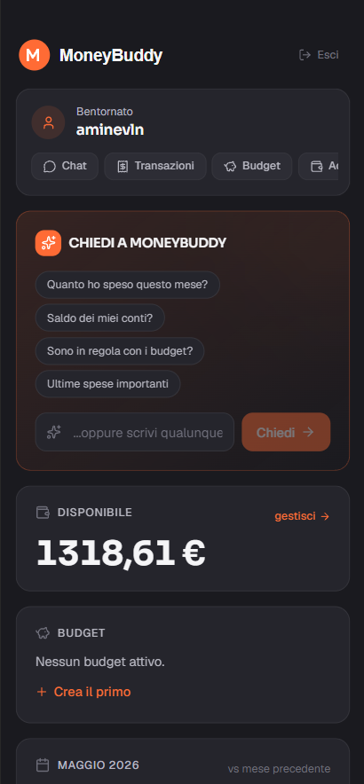
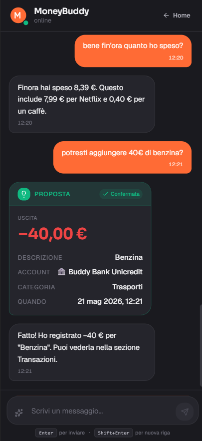
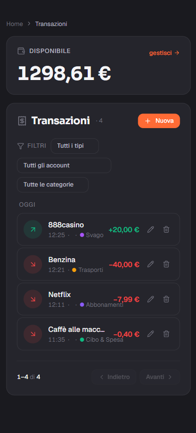
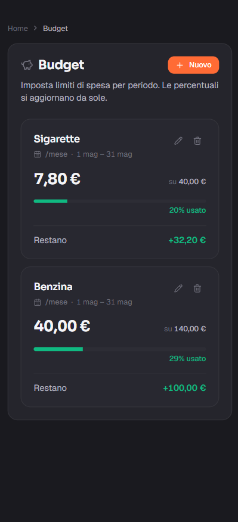
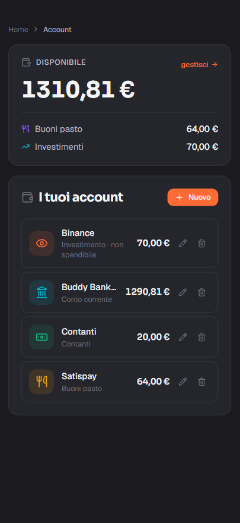
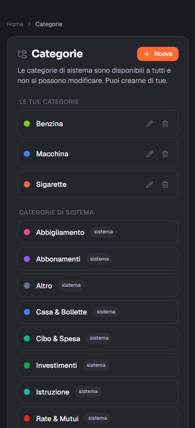
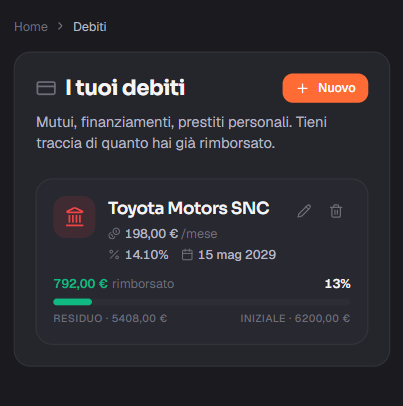
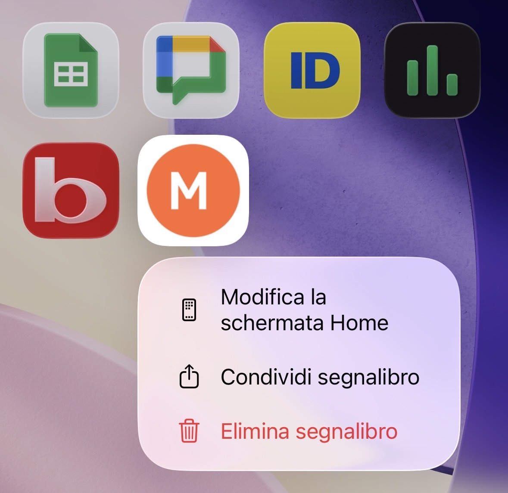
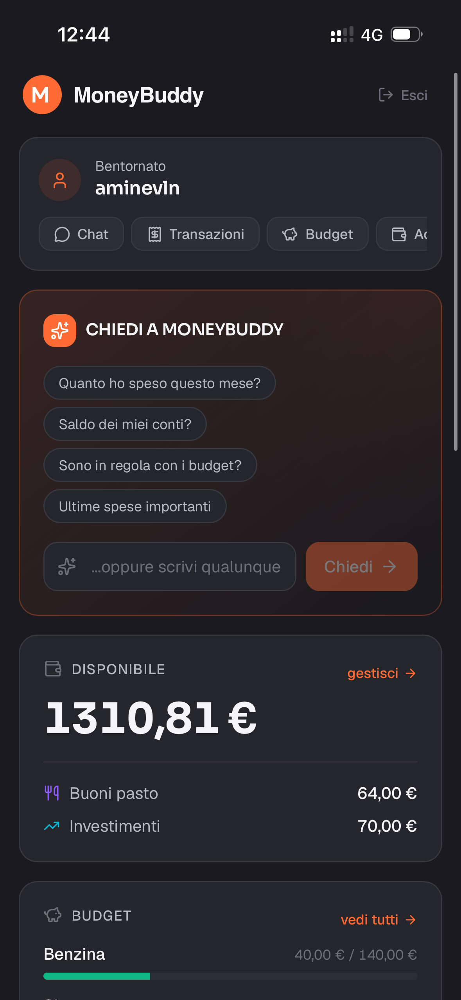

<div align="center">



# 🐷 MoneyBuddy

**Il tuo assistente finanziario personale con AI.**  
Tieni traccia delle tue finanze chattando in linguaggio naturale.

[](https://moneybuddy.up.railway.app)
[](https://moneybuddy.up.railway.app)


</div>

---

## ✨ Cosa fa

Invece di compilare moduli per ogni transazione, parli con un assistente AI in italiano naturale:

> *"ho preso un caffè da 1.50€"*

MoneyBuddy capisce, classifica la spesa (Bar/Caffè), sceglie l'account corretto (Buddy Bank Unicredit), propone la transazione e ti chiede conferma con un tap. Tutto qui.

E se chiedi *"mi conviene spendere 100€ in birra stasera?"*, leggerà il tuo budget Svago, le spese recenti, e ti darà un parere onesto basato sui tuoi dati.

---

## 🎬 Demo

### Chat AI con tool calling


L'AI estrae automaticamente importo, descrizione, esercente, account e categoria dalla frase libera. Conferma con un tap.

### Empty state della chat


Suggerimenti contestuali quando la chat è vuota.

### Transazioni con balance e filtri


Raggruppamento per giorno, filtri per tipo/account/categoria, balance summary in cima.

### Budget con barre di progresso


Barre colorate (verde/giallo/rosso) basate sulla percentuale di spesa rispetto al limite.

### Settings — Account


Conto corrente, contanti, carte di credito, investimenti, buoni pasto: ognuno con icona Lucide e colore semantico.

### Settings — Categorie


Categorie di sistema + categorie personalizzate con color picker custom.

### Settings — Debiti


Tracking mutui, finanziamenti e prestiti con barra di rimborso progressivo.

### Auth — Login


Auth flow completo: login, register, password reset via token email.

### PWA installata su iPhone
<table>
  <tr>
    <td></td>
    <td></td>
  </tr>
  <tr>
    <td align="center"><sub>Icona installata sulla home</sub></td>
    <td align="center"><sub>App aperta in modalità standalone</sub></td>
  </tr>
</table>

Installabile come app nativa via "Aggiungi alla schermata Home" su iPhone e Android.

---

## 🛠️ Tech stack

### Frontend
- **Next.js 16** App Router con React Server Components
- **React 19** + **TypeScript** strict
- **Tailwind v4** con design tokens custom in CSS variables
- **TanStack Query** per data fetching con optimistic updates
- **PWA** installabile con manifest dinamico (`app/manifest.ts`)
- **Lucide React** per le icone (zero emoji nell'UI)

### Backend
- **FastAPI** + **Python 3.12** completamente async
- **SQLAlchemy 2.0** async + **Alembic** per migrations
- **Pydantic v2** per validation e settings
- **PostgreSQL 16** + **pgvector** per RAG (memoria semantica)
- **Argon2id** per password hashing, **JWT** access+refresh tokens
- **uv** come package manager (10-100x più veloce di pip)

### AI
- **Google Gemini 2.5 Flash** per chat principale + tool use
- **Gemini Flash-Lite** per intent classification
- **Gemini embeddings** (768-dim) per RAG sulla memoria utente

### Deploy
- **Vercel** per il frontend (auto-deploy on push, CDN globale)
- **Railway** per backend + Postgres (Docker multi-stage, healthcheck)
- **Auto-migrations** Alembic al boot del container

---

## 🚀 Funzionalità

### Chat AI con tool use
- Comprensione linguaggio naturale italiano
- Tool calling per creare transazioni con campi dedotti
- Anti-hallucination: non chiama tool se mancano dati, chiede chiarimenti
- Context-aware: legge budget/transazioni/memorie prima di rispondere

### Append-only ledger
- Le transazioni non si "modificano" o "cancellano"
- Soft delete via `voided_at` per audit trail completo
- Database trigger ricalcola saldi automaticamente

### RAG con pgvector
- L'AI ricorda preferenze, obiettivi, abitudini dell'utente
- Embedding via Gemini, similarity search via pgvector cosine distance
- Memoria iniettata nel context delle conversazioni

### Budget management
- Periodi multipli (weekly, monthly, yearly)
- Categoria-specifici o generici
- Progress bar con severity colors

### Asset tracking
- Auto, casa, dispositivi, animali
- Attributi JSON liberi (anno, modello, razza, ecc.)
- L'AI usa gli asset per ragionare ("hai spesso fatto benzina, hai un'auto")

### PWA installabile
- Manifest dinamico Next 16 con shortcuts ("Apri chat", "Nuova transazione")
- Icone multi-size (192, 512, maskable)
- Apple touch icon + theme color

---

## 🏃 Quick start (locale)

### Prerequisiti
- Docker + Docker Compose
- Node 20+ + pnpm
- Python 3.12+ con [uv](https://github.com/astral-sh/uv)
- API key Google AI Studio: https://aistudio.google.com/apikey

### Setup

```bash
# 1. Clone
git clone https://github.com/aminevln/moneybuddy.git
cd moneybuddy

# 2. Database (Postgres + pgvector)
make up

# 3. Backend
cp backend/.env.example backend/.env
# Riempi GOOGLE_API_KEY in backend/.env
make migrate
make seed
make backend

# 4. Frontend (in un altro terminale)
cp frontend/.env.example frontend/.env.local
make frontend

# 5. Vai a http://localhost:3000
```

---
## 🗺️ Roadmap

- [ ] Push notifications (reminder stipendio, alert budget)
- [ ] Memory auto-extraction dalle conversazioni
- [ ] Onboarding flow guidato per nuovi utenti
- [ ] Email verification + rate limiting su /auth/login
- [ ] Playwright E2E tests
- [ ] Reports mensili automatici via AI

---

## 👤 Author

**Amine Ferhane**

- GitHub: [@aminevln](https://github.com/aminevln)
- Live demo: [moneybuddy.up.railway.app](https://moneybuddy.up.railway.app)

---

<div align="center">
<sub>Built with ❤️ in Santa Vittoria d'Alba · 2026</sub>
</div>

---

## 🏗️ Architettura
